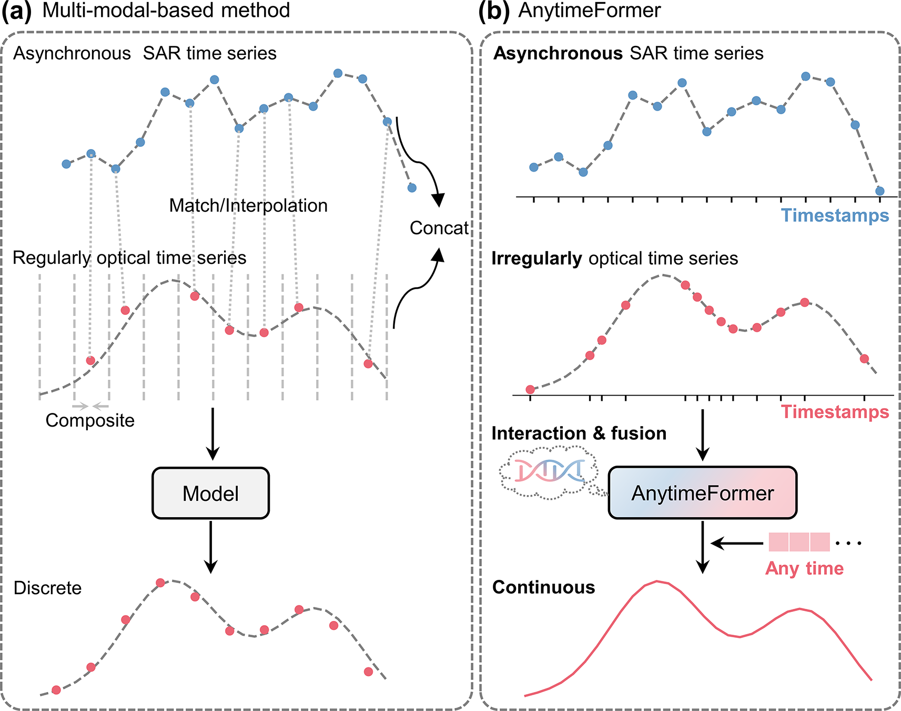
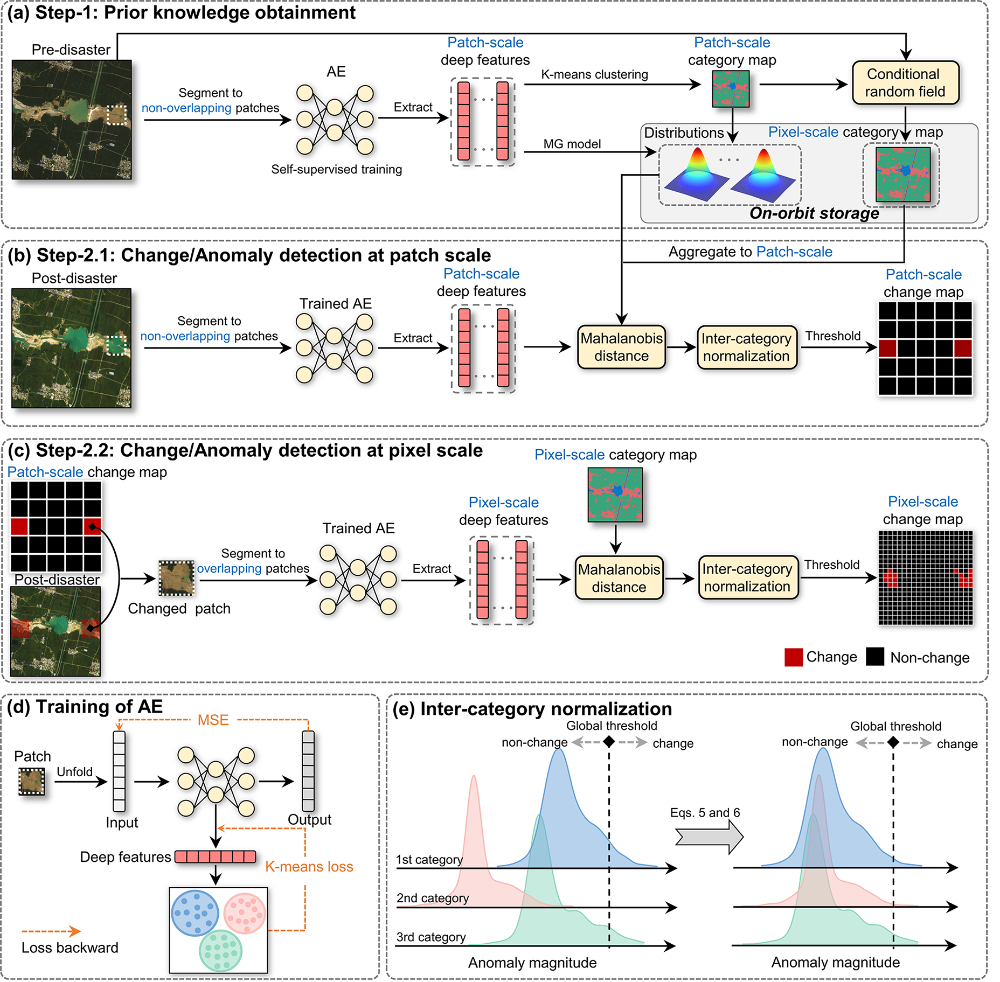
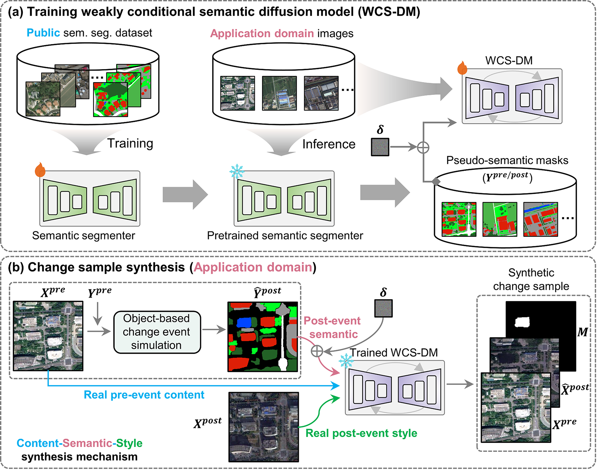
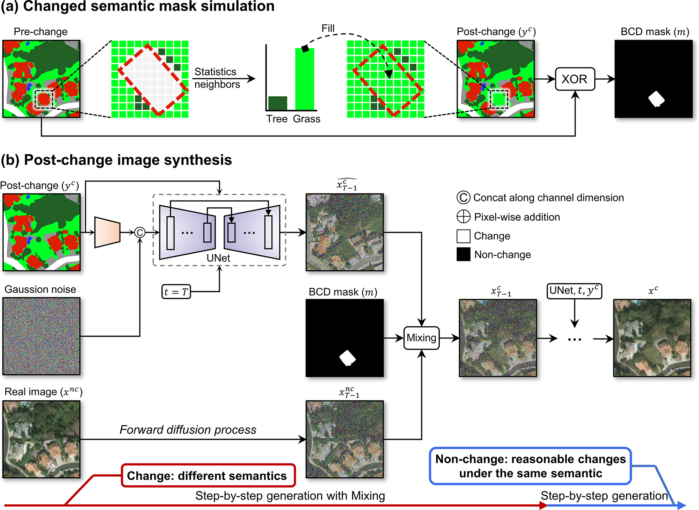

---
permalink: /
title: "Tang Kai | Academic Homepage"
excerpt: "Ph.D. candidate at Beijing Normal University working on remote sensing change detection, agricultural intelligence, and multimodal data fusion"
author_profile: true
---

# About Me

  

    I am <strong>Tang Kai (唐凯)</strong>, a Ph.D. candidate in Cartography and Geographic Information Systems at
    Beijing Normal University (2022.09-2026.06), advised by Prof.
    <a href="https://geot.bnu.edu.cn/Public/htm/news/5/176.html">Jin Chen</a>.
    My research focuses on remote sensing image processing and applications, change detection, on-orbit computing,
    and artificial intelligence for Earth observation.
  

  

    My research experience began with Remote Sensing Science and Technology during my undergraduate study, followed by
    master's research on radiometric quality improvement and physical parameter retrieval for China's Fengyun
    meteorological satellites. During my Ph.D. study, I have focused on deep learning-based change detection and
    multimodal data fusion, with an emphasis on integrating remote sensing physics and geoscientific knowledge into
    AI models.
  

  

    I am always open to collaboration and academic exchange with researchers and practitioners interested in remote
    sensing, GeoAI, change detection, agricultural intelligence, data fusion, and Earth observation applications.
  

# Research Interests
- Change detection: high-resolution single/bi-temporal change detection, medium-resolution time-series change detection, and near-real-time anomaly discovery.
- Data fusion: optical-SAR fusion, asynchronous time-series reconstruction, and multimodal Earth observation learning.
- Agricultural remote sensing: crop mapping, sowing and harvest date detection, yield estimation.

# News
- **2026.03** A [Paper](https://doi.org/10.1016/j.cj.2026.03.002) on estimation of crop sowing dates was accepted by *The Crop Journal* (JCR Q1 TOP).
- **2026.03** [ClearSCD](https://doi.org/10.1016/j.isprsjprs.2024.04.013) has been selected as an ESI Highly Cited Paper.
- **2026.02** A [Paper](https://doi.org/10.1016/j.isprsjprs.2026.02.039) on crop mapping models was accepted by *ISPRS Journal of Photogrammetry and Remote Sensing* and released with [[Code]](https://github.com/tianyu43/PEACE-Net).
- **2026.01** [DreamCD](https://doi.org/10.1016/j.jag.2026.105125) was accepted by *International Journal of Applied Earth Observation and Geoinformation* and released with [[Code]](https://github.com/tangkai-RS/DreamCD) and [[Dataset]](https://doi.org/10.5281/zenodo.17765755).
- **2026.01** [Shield](https://spj.science.org/doi/10.34133/remotesensing.0929) was accepted by *Journal of Remote Sensing* and released with [[Code]](https://github.com/tangkai-RS/Shield).

# Selected Publications

RSE 2026

**AnytimeFormer: Fusing irregular and asynchronous SAR-optical time series to reconstruct reflectance at any given time.**  
*Remote Sensing of Environment*, 2026.  
**Kai Tang**, Xuehong Chen, Tianyu Liu, Anqi Li, Yao Tang, Peng Yang, Jin Chen†  
[[Paper]](https://doi.org/10.1016/j.rse.2025.115120) [[Code]](https://github.com/tangkai-RS/AnytimeFormer)

JRS 2026

**Unsupervised detection of disaster-affected areas by combining the strengths of change detection and anomaly detection: target for on-orbit application.**  
*Journal of Remote Sensing*, 2026.  
**Kai Tang**, Qiao Wang, Fei Xu, Zhuoning Gu, Xuehong Chen, Jin Chen†  
[[Paper]](https://spj.science.org/doi/10.34133/remotesensing.0929) [[Code]](https://github.com/tangkai-RS/Shield)

*A lightweight framework designed for real-time disaster analysis and on-orbit deployment*.

JAG 2026

**DreamCD: A change-label-free framework for change detection via a weakly conditional semantic diffusion model in optical VHR imagery.**  
*International Journal of Applied Earth Observation and Geoinformation*, 2026.  
**Kai Tang**, Zhuo Zheng, Hongruixuan Chen, Xuehong Chen, Jin Chen†  
[[Paper]](https://doi.org/10.1016/j.jag.2026.105125) [[Code]](https://github.com/tangkai-RS/DreamCD) [[Dataset]](https://doi.org/10.5281/zenodo.17765755)

ISPRS J P&RS 2024

**The ClearSCD model: Comprehensively leveraging semantics and change relationships for semantic change detection in high spatial resolution remote sensing imagery.**  
*ISPRS Journal of Photogrammetry and Remote Sensing*, 2024.  
**Kai Tang**, Fei Xu, Xuehong Chen, Qi Dong, Yuheng Yuan, Jin Chen†  
[[Paper]](https://doi.org/10.1016/j.isprsjprs.2024.04.013) [[Code]](https://github.com/tangkai-RS/ClearSCD)

arXiv 2024

**Changeanywhere: Sample generation for remote sensing change detection via semantic latent diffusion model.**  
*arXiv*, 2024.  
**Kai Tang**, Jin Chen†  
[[Paper]](https://arxiv.org/pdf/2404.08892) [[Dataset]](https://huggingface.co/datasets/tangkaii/ChangeAnywhere-100K/tree/main)

# Education
- **2022.09-2026.06** Ph.D. in Cartography and Geographic Information Systems, Beijing Normal University. 
- **2019.09-2022.06** M.Eng. in Surveying and Mapping Engineering, Shandong University of Science and Technology.
- **2015.09-2019.06** B.Eng. in Remote Sensing Science and Technology, Shandong Agricultural University. 

# Honors and Awards
- **2025.01** Academic Innovation Award, Beijing Normal University.
- **2023.11** First Prize, Graduate Academic Competition, Faculty of Geographical Science, Beijing Normal University.
- **2022.05** Outstanding Graduate of Shandong Province.
- **2021.10** National Graduate Scholarship.

# Academic Services
- Reviewer for *Remote Sensing of Environment*, *ISPRS Journal of Photogrammetry and Remote Sensing*, *IEEE Transactions on Geoscience and Remote Sensing*, *International Journal of Applied Earth Observation and Geoinformation*, *International Digital Earth*, *Ecosystem Health and Sustainability*, and *Journal of Remote Sensing*.

# Contact
- **Email:** [tangkai@mail.bnu.edu.cn](mailto:tangkai@mail.bnu.edu.cn)
- **Alternate email:** [a1362723810@gmail.com](mailto:a1362723810@gmail.com)

